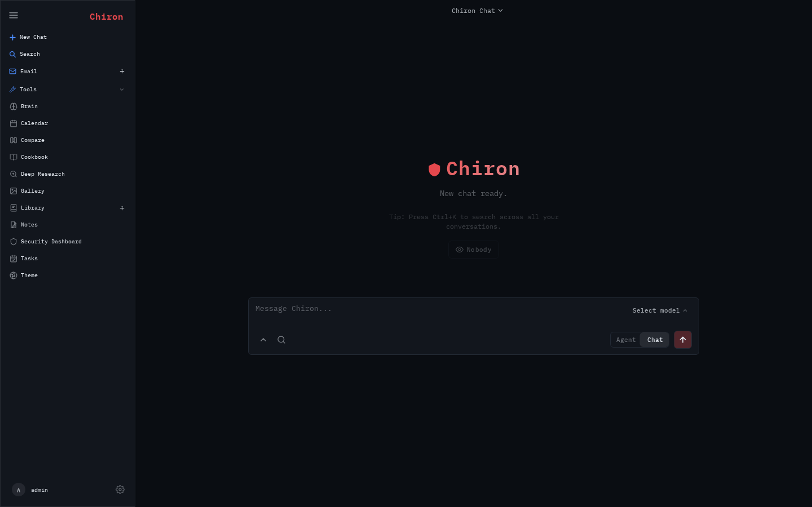

<p align="center">
  
</p>

<p align="center">
  <strong>Chiron</strong> — a cybersecurity-focused fork of <a href="https://github.com/pewdiepie-archdaemon/odysseus">Odysseus</a>.<br>
  Self-hosted AI workspace extended with penetration testing, OSINT, and threat intelligence tooling.
</p>

<p align="center">
  <a href="#quick-start">Quick Start</a> ·
  <a href="#architecture">Architecture</a> ·
  <a href="#mcp-tools">MCP Tools</a> ·
  <a href="#security-hub">Security Hub</a> ·
  <a href="#skills">Skills</a> ·
  <a href="#configuration">Configuration</a> ·
  <a href="docs/adr/">Decision Records</a> ·
  <a href="docs/roadmap-fork.md">Roadmap</a>
</p>

<p align="center">
  
  
  
</p>

<p align="center">
  
</p>

---

## What This Is

Chiron layers a complete cybersecurity toolchain on top of a self-hosted AI workspace (see credit above). The base platform provides chat, agents, memory, deep research, documents, and MCP — this fork adds:

- **22 cybersecurity MCP servers** wired to a Kali-based sidecar, SpiderFoot OSINT platform, OpenSearch, BentoPDF, and CyberChef
- **Toolchain audit trail + rate limiting** — every scan/exploit/recon call is logged (what ran, against what, when, how it turned out) and throttled per-binary, both enforced at the one chokepoint every red-team MCP server's calls pass through
- **Pre-built agent skill workflows** for reconnaissance, OSINT, incident response, threat hunting, malware analysis, web assessment, continuous monitoring, and reporting
- **Continuous scanning** — schedule recon (ports/subdomains/TLS cert/CVEs) to re-run on a cron and only file a finding when something actually changed
- **IOC watchlist** — persistent indicators re-checked against Shodan/VirusTotal/OTX/Censys, with a finding filed on any hit
- **SpiderFoot** (200+ correlated OSINT modules) running as a persistent REST API sidecar
- **BentoPDF** — client-side PDF toolkit for metadata extraction, report assembly, and interactive editing
- **Asset inventory** with SQLite-backed tracking of hosts, services, and findings, groupable under named engagements/cases
- **MITRE ATT&CK mapping** — STIX-based technique lookup and TTP correlation
- **CVSS risk scoring** — aggregated risk summaries and prioritized remediation plans
- **OpenSearch findings persistence** — index, search, and track findings across engagements
- **Sigma detection rules** — the log-detection complement to YARA's file-pattern matching, tested directly against your findings index
- **Pentest report templates** aligned to PTES and the OWASP Testing Guide

Everything runs locally. No telemetry. All tool execution stays on your own infrastructure.

> **Authorization requirement:** All active tools (nmap, sqlmap, nuclei, etc.) require explicit authorization for any target. The toolchain will execute what you instruct — only point it at systems you are authorized to test.

---

## Quick Start

**Prerequisites:** Docker + docker compose (or Podman + podman-compose), git.

```bash
git clone https://github.com/nixbys/chiron.git
cd chiron
cp .env.example .env
# Edit .env — add your API keys (see Configuration below), and set
# ODYSSEUS_CONTAINER_RUNTIME=docker (the fork's own default is podman — see below)
docker compose -f docker-compose.yml -f docker-compose.security.yml --profile sidecars up -d --build
```

Open `http://localhost:7000` once containers are healthy. The first admin password prints in:

```bash
docker logs odysseus
```

**Prefer Podman?** It's fully supported and is what this fork is actually developed and tested against day to day (daemonless, rootless by default, and this fork's own `ODYSSEUS_CONTAINER_RUNTIME` default — see [ADR 002](docs/adr/002-podman-over-docker.md)). Just swap `docker compose`/`docker logs` above for `podman-compose`/`podman logs` and leave `ODYSSEUS_CONTAINER_RUNTIME` unset.

Native installs, GPU notes, Windows/macOS instructions, and HTTPS are covered in the upstream [setup guide](docs/setup.md).

---

## Architecture

Chiron is the upstream Odysseus core — chat, agents, memory, research, documents — **unmodified**, with 22 security MCP servers layered on top and wired to a handful of sidecar services. Everything below the core is additive: it lives in `mcp_servers/`, `docker/toolchain/`, and `docker-compose.security.yml`, and attaches to the same container network without touching a single upstream file.

The 22 servers split along the offense/defense line from [ADR 007](docs/adr/007-security-detection-lifecycle.md) — **Red** (runs tools against a target), **Blue** (persists, correlates, and watches for drift), and one **Utility** server that's neither:

```mermaid
graph TD
    Core(["<b>Chiron</b> — port 7000<br/>Chat · Agents · Memory · Research · Documents"])

    Core -->|MCP stdio| RedGroup
    Core -->|MCP stdio| BlueGroup
    Core -->|MCP stdio| UtilGroup

    subgraph RedGroup["🔴 Red — offense"]
        direction TB
        recon[recon_server]
        osint[osint_server]
        webvuln[web_vuln_server]
        hashcrack[hashcrack_server]
        exploit[exploit_server]
        msf[msf_server]
        intel[intel_server]
        sfserver[spiderfoot_server]
        pdf[pdf_server]
    end

    subgraph BlueGroup["🔵 Blue — defense"]
        direction TB
        yara[yara_server]
        sigma[sigma_server]
        findings[findings_server]
        asset[asset_server]
        engagement[engagement_server]
        monitor[monitor_server]
        watchlist[watchlist_server]
        audit[audit_server]
        attck[attck_server]
        compliance[compliance_server]
        risk[risk_server]
        host[host_telemetry_server]
    end

    subgraph UtilGroup["⚪ Utility"]
        transform[transform_server]
    end

    recon --> Toolchain
    osint --> Toolchain
    webvuln --> Toolchain
    hashcrack --> Toolchain
    exploit --> Toolchain
    msf --> Toolchain
    yara --> Toolchain

    intel --> ThreatAPIs[("Shodan · VirusTotal<br/>OTX · Censys · NVD")]
    watchlist --> ThreatAPIs
    sfserver --> SpiderFoot[("odysseus-spiderfoot<br/>200+ modules · REST :5001")]
    pdf -.->|hands off URL| BentoPDF[("odysseus-bentopdf<br/>:3000")]

    findings --> OpenSearch[("odysseus-opensearch<br/>findings + sigma index · :9200")]
    sigma --> OpenSearch

    asset --> SQLite[("SQLite, WAL mode<br/>assets · engagements · monitor<br/>watchlist · audit")]
    engagement --> SQLite
    monitor --> SQLite
    watchlist --> SQLite
    audit --> SQLite

    Core -.->|Connected Services link only| CyberChef[("odysseus-cyberchef<br/>manual encode/decode · :8000")]

    Toolchain[["odysseus-toolchain — Kali Rolling<br/>nmap · masscan · ffuf · nikto · gobuster<br/>sqlmap · nuclei · subfinder · john · hydra<br/>yara · theHarvester · recon-ng · exploitdb · trivy"]]
```



A few things the diagram compresses that are worth spelling out:

- **Not every Blue server touches shared infrastructure.** `attck_server` and `compliance_server` cache free public datasets (MITRE STIX, NIST OSCAL) locally with a 7-day TTL; `risk_server`, `host_telemetry_server`, and `transform_server` run entirely in-process (pure computation or `psutil`) with no sidecar, network call, or database at all.
- **`audit_server` is read-only.** The audit trail it exposes is written by `mcp_servers/common.py` itself, at the one chokepoint (`exec_in_toolchain()`) every toolchain-backed call above already passes through — no server-side code needed to change to get audit logging or rate limiting.
- **CyberChef is a dead end by design.** It's the one sidecar no MCP server calls — a pure link target surfaced in the Security Hub's Connected Services tab for manual encode/decode/crypto work.
- **Nothing here is a foreign key.** MCP servers never import each other or share a database connection; where they need to agree on something (an `engagement_id`, a finding's fields), it's a documented convention, not a schema constraint.

See [MCP Tools](#mcp-tools) below for what each server actually does, and the [repository layout](#repository-layout) for where it lives on disk.

---

## MCP Tools

Every tool below is exposed to the chat/agent layer over stdio MCP — nothing here requires a separate integration step beyond registering the server (see [`docs/develop-mcp-servers.md`](docs/develop-mcp-servers.md), or run [`scripts/register_fork_mcp_servers.py`](scripts/register_fork_mcp_servers.py) to register all 22 at once). Servers are listed roughly in offense → defense → utility order, matching the [Architecture](#architecture) diagram above.

### `recon_server` — Network Reconnaissance

| Tool | Description |
|------|-------------|
| `nmap_scan` | Port and service version scan (nmap) |
| `masscan_scan` | High-speed TCP port discovery (masscan) |
| `tls_cert_info` | TLS certificate details (issuer, validity, SANs) via nmap's `ssl-cert` script — used by `monitor_server`'s scheduled cert-drift check |

### `intel_server` — Threat Intelligence

| Tool | Description |
|------|-------------|
| `shodan_host` | Open ports, banners, and CVEs from Shodan |
| `virustotal_lookup` | Hash, URL, domain, or IP reputation check |
| `cve_lookup` | NVD CVE search by ID or keyword |
| `otx_indicator` | AlienVault OTX threat intel lookup |
| `censys_host` | Open services, TLS certificates, and ASN info for a host IP from Censys |
| `censys_search` | Search Censys hosts by Censys Search Language query |

### `osint_server` — Passive OSINT

| Tool | Description |
|------|-------------|
| `harvester` | Email, subdomain, and employee harvest (theHarvester) |
| `username_search` | Cross-platform username enumeration (Sherlock) |
| `dns_enum` | DNS record enumeration (A, MX, NS, TXT, CNAME) |
| `whois_lookup` | WHOIS registration data |
| `subdomain_enum` | Passive subdomain enumeration via Amass (cert transparency, DNS brute-force, APIs) |
| `secrets_scan` | Clone a git repo and scan its full history for leaked credentials/API keys/tokens (gitleaks) -- matched secret values are redacted, never shown in full |

### `web_vuln_server` — Web Assessment

| Tool | Description |
|------|-------------|
| `nikto_scan` | Web server misconfiguration and version scan |
| `gobuster_dir` | Directory and file brute-force |
| `sqlmap_scan` | SQL injection detection (non-destructive by default) |
| `nuclei_scan` | Template-based vulnerability scanning |
| `ffuf_fuzz` | Fast parameter/header/path fuzzing (ffuf) against an authorized target |

### `hashcrack_server` — Password / Hash

| Tool | Description |
|------|-------------|
| `identify_hash` | Hash type identification (hashid) |
| `john_crack` | Wordlist-based hash cracking (john) |

### `spiderfoot_server` — Correlated OSINT (SpiderFoot)

| Tool | Description |
|------|-------------|
| `sf_scan_start` | Start an async SpiderFoot scan, returns scan ID |
| `sf_scan_status` | Poll scan progress by ID |
| `sf_scan_results` | Retrieve structured results, optionally filtered by event type |
| `sf_quick_scan` | Blocking convenience: start → wait → return results |
| `sf_list_scans` | List all scans with status and result counts |
| `sf_module_list` | Browse available SpiderFoot modules |

SpiderFoot use cases: `passive` (no active probing), `investigate` (balanced), `footprint` (full surface mapping), `all`.

### `pdf_server` — PDF Intelligence and Report Assembly

| Tool | Description |
|------|-------------|
| `pdf_metadata` | Extract author, company, software, and timestamps — OSINT goldmine |
| `pdf_extract_text` | Pull text content from collected PDFs for keyword analysis |
| `pdf_info` | Page count, encryption status, embedded files — quick triage |
| `pdf_merge` | Assemble a final pentest report from per-tool output PDFs |
| `pdf_extract_pages` | Carve specific pages from a large document |
| `pdf_bentopdf_url` | Return the BentoPDF UI URL for interactive editing tasks |
| `generate_report` | Render markdown/plain-text content (OSINT summaries, pentest findings) to a formatted PDF |
| `generate_engagement_report` | One-call PDF summary for an engagement: scope, findings summary, and timeline |

Uses `pypdf` (already in `requirements.txt`) — no additional dependencies. For interactive work (redaction, compression, format conversion, signing), the agent hands users the BentoPDF URL at `http://localhost:3000`.

`generate_engagement_report` pulls an engagement's scope/description/tags and recent timeline (`engagement_server`'s SQLite store) plus a findings summary (severity/status counts and top findings, best-effort from `findings_server`'s OpenSearch index — the report still generates without that section if OpenSearch is unreachable), renders them through `generate_report`'s existing markdown pipeline, and saves one PDF. Pass `compliance_summary` (e.g. text pre-built from `compliance_server`'s `nist_map`) to include it as its own section. Like `sigma_server` duplicating `findings_server`'s OpenSearch connection rather than importing it, this reads the engagements/findings stores directly (MCP servers here never import each other) rather than going through `engagement_get`/`finding_search`'s own formatted-text tools.

### `yara_server` — YARA Malware Detection

| Tool | Description |
|------|-------------|
| `yara_scan` | Scan a file or directory against stored YARA rules |
| `yara_rule_write` | Save a new YARA rule to the rules directory |
| `yara_list_rules` | List all available YARA rules |

Rules are stored under `/workspaces/yara_rules/` inside the Kali container.
See `sigma_server` below for the log-detection equivalent. Backs the
`yara_sweep` scheduled-task action (`src/builtin_actions.py`): on a cron
schedule, re-runs `yara_scan` against a configured target and diffs the
matched (rule, path) pairs against the last stored snapshot
(`monitor_server`), filing a finding + reminder only when matches changed
since the last sweep. Configure via the task's prompt as JSON, e.g.
`{"target": "case-123/evidence", "engagement_id": "..."}`.

### `exploit_server` — Exploit Database

| Tool | Description |
|------|-------------|
| `searchsploit` | Search Exploit-DB by keyword via searchsploit |
| `exploit_db_lookup` | Fetch exploit details by EDB ID |
| `cve_to_exploit` | Find all known exploits for a CVE identifier |

Uses the local `exploitdb` package installed in the Kali container — no network required.

### `msf_server` — Metasploit Module Search

| Tool | Description |
|------|-------------|
| `msf_search` | Search Metasploit Framework modules by keyword, CVE ID, platform, or type |
| `msf_module_info` | Full details (description, targets, options, references) for one module |

Read-only in this phase — module search/info only, via a one-shot `msfconsole -q -x`. No RPC daemon, no session-driven exploit execution or payload delivery; that's a separate, riskier follow-up.

### `transform_server` — Data Transformation

| Tool | Description |
|------|-------------|
| `encode` | Base64, hex, URL, or HTML encode |
| `decode` | Reverse of encode |
| `hash_data` | MD5, SHA1, SHA256, SHA512, bcrypt hash |
| `gzip_compress` | Compress data to base64-encoded gzip |
| `gzip_decompress` | Decompress base64-encoded gzip |
| `regex_extract` | Extract all regex matches from text |
| `jwt_decode` | Decode and inspect a JWT (no verification) |
| `xor` | XOR a string against a single-byte or multi-byte key |

All transforms run in-process — no toolchain call required.

### `asset_server` — Asset Inventory

| Tool | Description |
|------|-------------|
| `asset_add` | Register a host in the inventory |
| `asset_list` | List all tracked assets with metadata |
| `asset_summary` | Inventory summary: asset counts, severity breakdown, top risks |
| `service_add` | Record an open service on a tracked asset |
| `finding_add` | Log a security finding against an asset |
| `finding_list` | List findings, optionally filtered by asset or severity |
| `finding_update` | Update a finding's status (e.g. remediated, false positive) |

Backed by a WAL-mode SQLite database at `$ODYSSEUS_DATA_DIR/assets.db`.

### `attck_server` — MITRE ATT&CK

| Tool | Description |
|------|-------------|
| `attck_update` | Refresh the local ATT&CK STIX dataset (7-day TTL cache) |
| `attck_technique` | Look up a technique by ID (e.g., T1059.001) |
| `attck_tactic` | List all techniques under a tactic |
| `attck_search` | Free-text search across technique names and descriptions |
| `attck_map` | Map a list of technique IDs to their full details |

STIX data sourced from `github.com/mitre/cti`, cached locally.

### `compliance_server` — NIST 800-53 Compliance Mapping

| Tool | Description |
|------|-------------|
| `nist_update` | Refresh the local NIST SP 800-53 Rev 5 OSCAL catalog (7-day TTL cache) |
| `nist_control` | Look up a control by ID (e.g. `AC-2` or `AC-2.1` for an enhancement) — title, statement, guidance, related controls |
| `nist_family` | List all controls under a control family (e.g. `AC`, `SC`, `IA`) |
| `nist_search` | Search control titles by keyword |
| `nist_map` | Map a list of ATT&CK tactic names and/or Chiron finding tags to control families via a small hand-authored heuristic table |

Same shape as `attck_server` above: fetches and caches NIST's free OSCAL JSON catalog (`usnistgov/oscal-content` on GitHub) rather than bundling it. CIS Controls v8 is deliberately out of scope — unlike NIST's OSCAL data, CIS's control text isn't freely redistributable. `nist_map`'s table is explicitly a rough grouping for a compliance summary, not authoritative NIST guidance — it keys on ATT&CK's own small tactic-name vocabulary and Chiron's finding tags/check types, not a per-technique crosswalk.

### `risk_server` — CVSS Risk Scoring

| Tool | Description |
|------|-------------|
| `risk_score_finding` | Score a finding: CVSS base × criticality × exploitability |
| `asset_risk` | Aggregate risk score for a single asset |
| `risk_summary` | Full risk summary across all tracked assets |
| `remediation_plan` | Prioritized remediation list sorted by risk score |

Risk formula: `CVSS_base × criticality_multiplier × exploitability_factor`, capped at 30.0.

### `findings_server` — OpenSearch Findings Persistence

| Tool | Description |
|------|-------------|
| `finding_index` | Index a finding into OpenSearch |
| `finding_search` | Full-text search across all indexed findings |
| `finding_stats` | Count findings by severity and status |
| `finding_update_status` | Update the remediation status of a finding |

Index: `odysseus-findings` in the `opensearch` service (see `docker-compose.security.yml`).

Backs the `verify_remediation` scheduled-task action (`src/builtin_actions.py`): re-checks every `scheduled_recon`-sourced finding marked `remediated` to confirm the underlying issue (open port/subdomain/cert fingerprint/CVE) is actually still gone — no separate state store, it reconstructs what to re-test entirely from the finding's own `title`/`description` fields. Reopens the finding (`finding_update_status`) + sends a reminder if it's back; logs a confirming `engagement_server` event if it's genuinely still remediated. Scoped to `scheduled_recon` findings only — `watchlist_check`/`sigma_sweep`/`host_monitor` findings don't carry an equivalently well-defined single re-testable item. Configure via the task's prompt as JSON, e.g. `{"limit": 20, "engagement_id": "..."}`.

### `engagement_server` — Case / Engagement Grouping

| Tool | Description |
|------|-------------|
| `engagement_create` | Create a named engagement (pentest, red-team op, incident) with scope and client metadata |
| `engagement_list` | List engagements, optionally filtered by status |
| `engagement_get` | Get full engagement details plus its recent timeline |
| `engagement_update` | Update description, client, scope, or tags |
| `engagement_close` | Mark an engagement closed and record its end date |
| `engagement_log_event` | Append a scan/finding/note event to an engagement's timeline |
| `engagement_timeline` | Return the chronological timeline for a report |

Pass the returned `engagement_id` to `asset_server`'s `asset_add`/`finding_add` (an `engagement_id` column) and `findings_server`'s `finding_index` (the `engagement` field) to group activity by case; there's no shared database between servers, so `engagement_id` is a convention key, not a foreign key. Backed by a WAL-mode SQLite database at `$ODYSSEUS_DATA_DIR/engagements.db`.

### `monitor_server` — Continuous Scan Drift Tracking

| Tool | Description |
|------|-------------|
| `monitor_list_tasks` | List every (scheduled task, target, check) combination currently being monitored |
| `monitor_get_state` | Get the current stored snapshot for one monitored check |
| `monitor_diff_history` | List recent drift (added/removed items) recorded for a scheduled scan task |
| `monitor_reset` | Clear a stored snapshot so the next run re-baselines (use after a known infra change) |

Backs the `scheduled_recon` scheduled-task action (`src/builtin_actions.py`): a `ScheduledTask` with `task_type="action"` and `action="scheduled_recon"` re-runs `nmap_scan`/`subdomain_enum`/`tls_cert_info`/a Shodan CVE lookup against one or more configured targets on a cron schedule, diffs each result against the last stored snapshot here, and only files a finding (via `findings_server`) and sends one batched reminder per run when something actually changed — new open port, new subdomain, changed TLS cert fingerprint, or a new CVE. Configure the task's prompt as JSON, e.g. `{"target": "example.com", "checks": ["ports", "cert"], "engagement_id": "..."}`. Multiple targets: `{"targets": ["example.com", "10.0.0.5"], "checks": ["ports"]}` (also accepts `"target"` and `"targets"` together, merged). Or resolve targets from an engagement's own asset inventory instead of listing them by hand: `{"use_engagement_assets": true, "engagement_id": "...", "checks": ["ports"]}`. Also backs the `sigma_sweep`, `yara_sweep`, and `host_monitor` actions below the same way — same snapshot/diff mechanism, one row per (task, target, check type). Backed by a WAL-mode SQLite database at `$ODYSSEUS_DATA_DIR/monitor.db`.

### `watchlist_server` — IOC Watchlist

| Tool | Description |
|------|-------------|
| `watchlist_add` | Add an IP, domain, hash, or URL to the persistent watchlist |
| `watchlist_list` | List watchlist entries, filterable by kind, engagement, or status |
| `watchlist_remove` | Remove an entry permanently |
| `watchlist_pause` / `watchlist_resume` | Skip an entry in scheduled checks without losing its history |
| `watchlist_check_history` | Show each provider's last-checked snapshot for one entry |

Backs the `watchlist_check` scheduled-task action: on a cron schedule, re-checks every active entry against the threat-intel providers relevant to its kind (Shodan/Censys/OTX for IPs, OTX/VirusTotal for domains, VirusTotal for hashes/URLs — whichever have API keys configured), and files a finding + sends one batched reminder only when a provider's result changes since the last check. Backed by a WAL-mode SQLite database at `$ODYSSEUS_DATA_DIR/watchlist.db`.

### `sigma_server` — Sigma Detection Rules

| Tool | Description |
|------|-------------|
| `sigma_rule_write` | Save a Sigma detection rule (YAML), validating it parses |
| `sigma_rule_list` | List stored rules |
| `sigma_rule_delete` | Delete a stored rule |
| `sigma_rule_convert` | Convert a rule to an OpenSearch Lucene query, without running it |
| `sigma_rule_test` | Convert and run a rule against an OpenSearch index (default: `odysseus-findings`), returning match count and sample hits |

The log-detection complement to `yara_server`'s file-pattern detection — Sigma rules match structured log/finding data rather than files, so this runs entirely in-process (no Kali sidecar) via the optional `pysigma` + `pysigma-backend-opensearch` packages (`requirements-optional.txt`). Without them, `sigma_rule_write`/`list`/`delete` still work (rules just need to be valid YAML, not full Sigma structure); `sigma_rule_convert`/`sigma_rule_test` return a clear error until they're installed. Write detection logic against `findings_server`'s indexed fields (`title`, `severity`, `cve_id`, `ip`, `port`, `tool`, `description`, `status`, `tags`) unless pointing at a different index. Rules are stored as YAML files under `$ODYSSEUS_DATA_DIR/sigma_rules/`.

Backs the `sigma_sweep` scheduled-task action (`src/builtin_actions.py`): on a cron schedule, converts every stored rule (or a configured subset) and re-runs it against OpenSearch, diffing each rule's match IDs against the last stored snapshot (`monitor_server`) and filing a finding + reminder only when a rule's matches changed since the last sweep — severity is read from the rule's own `level:` field when present. Configure via the task's prompt as JSON, e.g. `{"rules": ["suspicious-logins"], "engagement_id": "..."}` (omit `"rules"` to sweep everything stored).

### `host_telemetry_server` — Host Telemetry

| Tool | Description |
|------|-------------|
| `host_processes` | List running processes (pid, name, user, cmdline) |
| `host_listening_ports` | List TCP/UDP sockets in LISTEN state, with owning pid where visible |
| `host_users` | List currently logged-in users (interactive sessions) |
| `host_cron_jobs` | List the invoking user's crontab plus system `cron.d` entries (Linux-only) |
| `host_packages` | List installed OS packages via `dpkg` or `rpm`, whichever is present (Linux-only) |

The blue-team complement to `recon_server`'s offensive scanning — read-only introspection of the host/container Chiron itself is running in, not an arbitrary pentest target. Runs entirely via `psutil` (pure Python, in-process) rather than `exec_in_toolchain()`, since the Kali toolchain sidecar's own process list is useless for defensive monitoring of anything real. **Scope caveat**: when Chiron runs inside a Docker container (the default deployment), these tools only ever see that container's own namespace — not the true underlying host — since no host-namespace passthrough (bind-mounted `/proc`, `pid: host`, etc.) exists in this fork yet; true host-level visibility from inside a container is a known gap, not solved here.

Backs the `host_monitor` scheduled-task action (`src/builtin_actions.py`): on a cron schedule, re-runs a configured subset of these checks and diffs each against the last stored snapshot (`monitor_server`), filing a finding + reminder only when something changed since the last run. Process-name churn from kernel worker threads (`kworker/N:M`, which the kernel renumbers constantly) is filtered out before diffing. Configure via the task's prompt as JSON, e.g. `{"checks": ["processes", "listening_ports", "users"], "engagement_id": "..."}` — defaults to `["processes", "listening_ports", "users"]`; `cron`/`packages` are opt-in and Linux-only.

### `audit_server` — Toolchain Invocation Audit Trail

| Tool | Description |
|------|-------------|
| `audit_list` | List recent toolchain invocations (what ran, against what, when, how it turned out), filterable by binary or outcome |
| `audit_stats` | Summarize invocation counts by binary and by outcome over a trailing window (default 24h) |

Findings persistence (`findings_server`) covers *results*; this covers *actions*. Every single `exec_in_toolchain()` call — the one chokepoint every red-team MCP server's tool calls pass through — is logged automatically by `mcp_servers/common.py` itself: binary, arguments, exec mode, duration, and outcome (`ok`/`error`/`timeout`/`rate_limited`). This server is the read side; nothing needs to call it to make logging happen. Same shared WAL-mode SQLite file (`$ODYSSEUS_DATA_DIR/audit.db`) also backs rate limiting — see below.

**Rate limiting**: also enforced inside `exec_in_toolchain()`, using this same audit table as its own source of truth (a true cross-process limit, since every MCP server is a separate subprocess — an in-memory counter would only ever throttle one server's own calls). `TOOLCHAIN_RATE_LIMIT` caps invocations of any one binary per `TOOLCHAIN_RATE_LIMIT_WINDOW` seconds (defaults: 20 per 60s); `TOOLCHAIN_RATE_LIMIT_<BINARY>` overrides the cap for one binary specifically, same override shape as `TOOLCHAIN_EXEC_MODE_<BINARY>`. Set `TOOLCHAIN_RATE_LIMIT_WINDOW=0` to disable entirely. A rejected call returns `[error:rate_limited]` immediately (never reaches the toolchain) and is itself logged with that outcome, so it shows up in the Audit Log tab too.

---

## Security Hub

Admin-only. A standalone page at `/security` (`static/security.html`, `static/js/securityHub.js`, routes under `routes/security_dashboard_routes.py`) — not a modal, opens from the sidebar/icon-rail "Security Hub" button like every other tool, but as a real page navigation rather than an overlay. Six tabs:

- **Overview** (`GET /api/security/dashboard`) — a snapshot across the security MCP servers' own stores: findings summary (severity/status counts, the same aggregation `findings_server`'s `finding_stats` uses), active watchlist entries, recent scan drift across every scheduled task (`monitor_server`), the engagement list, and a host telemetry summary (process/listening-port/logged-in-user counts).
- **Engagements** — browse, expand a row for scope + timeline detail, create, and close engagements.
- **Watchlist** — browse, add, pause/resume, and remove IOC watchlist entries.
- **Rules** — browse stored Sigma rules and YARA rule names (the latter via the toolchain sidecar), with a raw-content viewer for either.
- **Connected Services** (`GET /api/security/services`) — live reachability + a direct link for every sidecar: BentoPDF, CyberChef, SpiderFoot, OpenSearch, and Ollama (each published on `127.0.0.1` — see Quick Start's Hybrid mode section), plus the Kali toolchain's exec API shown as internal-only (it accepts arbitrary command execution and is never exposed to a browser, not even on loopback). Reachability is checked server-side against each service's internal container address, so this never needs a browser-side CORS probe.
- **Audit Log** (`GET /api/security/audit`) — every toolchain invocation (`audit_server`, see above), filterable by binary/outcome, with a 24h summary row.

Every write goes through the same MCP server module's `call_tool()` the chat/MCP-tool path already uses — one validation path, not a second one reimplemented for the REST route. Each section/tab is read via direct import of its MCP server module rather than the MCP text-tool interface, and is independently best-effort — one source failing (e.g. OpenSearch or the toolchain sidecar unreachable) surfaces as an `error` field on just that section, never a 500 for the whole page.

---

## Skills

Pre-built agent workflows in [`skills/`](skills/):

**Reconnaissance & OSINT**

| Skill | Description |
|-------|-------------|
| [`recon/full_recon`](skills/recon/full_recon.yaml) | Port scan → web enum → vuln scan → report |
| [`osint/target_profile`](skills/osint/target_profile.yaml) | DNS + WHOIS + theHarvester + Shodan passive profile |
| [`osint/spiderfoot_deep_scan`](skills/osint/spiderfoot_deep_scan.yaml) | Full SpiderFoot correlated scan with CVE and breach extraction |
| [`osint/pdf_intel`](skills/osint/pdf_intel.yaml) | Metadata + text extraction from collected PDFs, with entity correlation |

**Web Assessment**

| Skill | Description |
|-------|-------------|
| [`web_assessment/web_full`](skills/web_assessment/web_full.yaml) | nikto + gobuster + sqlmap + nuclei chain |

**Incident Response**

| Skill | Description |
|-------|-------------|
| [`incident_response/ransomware_response`](skills/incident_response/ransomware_response.yaml) | Host triage → IOC extraction → ATT&CK mapping → remediation plan |
| [`incident_response/network_compromise`](skills/incident_response/network_compromise.yaml) | Entry point scan → C2 intel → lateral movement TTPs → report |
| [`incident_response/credential_breach`](skills/incident_response/credential_breach.yaml) | Attacker intel → exposed service scan → credential-focused TTPs |
| [`incident_response/ioc_triage`](skills/incident_response/ioc_triage.yaml) | Rapid IOC triage against threat intel |
| [`incident_response/threat_actor_profile`](skills/incident_response/threat_actor_profile.yaml) | Build a threat actor dossier from OSINT and ATT&CK data |

**Threat Hunting**

| Skill | Description |
|-------|-------------|
| [`threat_hunting/ioc_hunt`](skills/threat_hunting/ioc_hunt.yaml) | Hunt for IOCs across the asset inventory |
| [`threat_hunting/network_exposure_audit`](skills/threat_hunting/network_exposure_audit.yaml) | Identify unexpected network exposure on known assets |

**Malware Analysis**

| Skill | Description |
|-------|-------------|
| [`malware_analysis/file_triage`](skills/malware_analysis/file_triage.yaml) | Static file triage: hashes, strings, YARA, exiftool |

**Reporting**

| Skill | Description |
|-------|-------------|
| [`reporting/pentest_report`](skills/reporting/pentest_report.md) | PTES/OWASP-aligned Markdown report template |

---

## Configuration

Copy `.env.example` to `.env` and populate the security overlay section:

```bash
# Shared secret for the Kali toolchain exec API
EXEC_API_TOKEN=change_me_before_deploy   # openssl rand -hex 32

# Threat intelligence APIs
SHODAN_API_KEY=
VIRUSTOTAL_API_KEY=
OTX_API_KEY=

# Censys (intel_server)
CENSYS_API_ID=
CENSYS_API_SECRET=

# OpenSearch (findings_server)
OPENSEARCH_URL=http://opensearch:9200
OPENSEARCH_USER=admin
OPENSEARCH_PASSWORD=admin

# Toolchain rate limiting (mcp_servers/common.py) — see audit_server above
TOOLCHAIN_RATE_LIMIT=20            # max invocations of one binary per window
TOOLCHAIN_RATE_LIMIT_WINDOW=60     # window in seconds; 0 disables rate limiting
# TOOLCHAIN_RATE_LIMIT_NMAP=5      # optional per-binary override
```

All base-platform options (model endpoints, auth, HTTPS, RAG, GPU) are documented in the upstream [setup guide](docs/setup.md). See `.env.example` for the complete annotated reference.

### Hybrid / local-tools mode

By default, `docker-compose.security.yml`'s `toolchain`, `spiderfoot`, `bentopdf`, `cyberchef`, and `opensearch` services are gated behind the shared `sidecars` Compose profile and started with `--profile sidecars`. Each service also carries its own profile name (`toolchain`, `spiderfoot`, `bentopdf`, `cyberchef`, `opensearch`), so you can start any subset directly — e.g. `--profile toolchain --profile bentopdf --profile opensearch` starts three of the five sidecars and skips SpiderFoot and CyberChef — without giving up the single-flag `--profile sidecars` shortcut for "start everything." If a tool or service is already installed on the machine running Chiron, you can skip its container and use the local install instead, per tool or per service:

- **Toolchain binaries** (`nmap`, `masscan`, `theHarvester`, `sherlock`, `dig`, `whois`, `amass`, `nikto`, `gobuster`, `sqlmap`, `nuclei`, `ffuf`, `hashid`, `john`, `yara`, `searchsploit`): set `TOOLCHAIN_EXEC_MODE=local` in `.env` to run every one of them directly on the app's own host instead of the sidecar, or set a per-binary override like `TOOLCHAIN_EXEC_MODE_NMAP=local` to switch just that one — see the commented block in `.env.example`. This requires the binary to actually be on `PATH` for the Chiron process; missing binaries return a clear `[error:not_installed]` rather than failing silently. Local mode runs the tool **unsandboxed**, without the toolchain container's `cap_drop: [ALL]` / `no-new-privileges` isolation — only enable it for tools you trust to run with the app's own privileges. Omit `toolchain` from `--profile sidecars` (or use the per-service profile flags above) once nothing routes through it.
- **Services** (SpiderFoot, OpenSearch, BentoPDF, Ollama): each is already reached through a plain URL env var (`SPIDERFOOT_URL`, `OPENSEARCH_URL`, `BENTOPDF_URL`, `OLLAMA_BASE_URL`) with no hardcoded container dependency. Point the var at an already-running local/VM-native instance (e.g. `SPIDERFOOT_URL=http://localhost:5001`) and skip starting that container via its profile.
- **CyberChef** is the one sidecar nothing calls programmatically (no MCP server talks to it, so there's no `CYBERCHEF_URL` to redirect) — it's a pure link target for manual use. Omit `cyberchef` from `--profile sidecars` if you'd rather use the public `https://gchq.github.io/CyberChef/` or a native install; the Connected Services tab just won't show it as reachable.
- **Status check**: `GET /api/toolchain/exec-modes` reports, per toolchain binary, the resolved mode (`local`/`container`) and — for `local` — whether it was actually found on `PATH`.
- **Automatic detection**: `setup.py` runs a host-capability scan (step 6) on every native install. It probes `PATH` for the toolchain binaries above and checks the well-known ports of the six sidecar services (verifying each by its response shape, not just "port is open," to avoid mistaking an unrelated service for the real one), then interactively offers to write the matching `TOOLCHAIN_EXEC_MODE_*` / service-URL lines into `.env` — printing the isolation trade-off and the Compose flags needed to skip that sidecar. It's a non-interactive no-op (never prompts, never writes) when stdin isn't a TTY or `ODYSSEUS_SKIP_HOST_SCAN` is set — including when `setup.py` runs automatically inside the container via `docker/entrypoint.sh`, where the binary scan is skipped outright (container isolation means it would only ever see the container's own `PATH`) but the service scan still runs, additionally checking `host.docker.internal`. Every accepted suggestion is logged to `logs/host_capability_scan.log`. See `src/host_capabilities.py`.

---

## Repository Layout

```
chiron/
├── mcp_servers/
│   ├── common.py                # Shared: exec_in_toolchain, mcp_error, validators
│   ├── recon_server.py          # nmap, masscan
│   ├── intel_server.py          # Shodan, VirusTotal, CVE/NVD, OTX, Censys
│   ├── osint_server.py          # theHarvester, Sherlock, DNS, WHOIS, Amass
│   ├── web_vuln_server.py       # nikto, gobuster, sqlmap, nuclei, ffuf
│   ├── hashcrack_server.py      # hashid, john
│   ├── spiderfoot_server.py     # SpiderFoot REST API client
│   ├── pdf_server.py            # PDF intel + report assembly (pypdf)
│   ├── yara_server.py           # YARA scan, rule management
│   ├── exploit_server.py        # searchsploit, Exploit-DB lookup
│   ├── msf_server.py            # Metasploit module search/info (read-only)
│   ├── transform_server.py      # encode/decode, hash, JWT, XOR (in-process)
│   ├── asset_server.py          # SQLite asset + findings inventory
│   ├── attck_server.py          # MITRE ATT&CK STIX lookup
│   ├── compliance_server.py     # NIST 800-53 Rev 5 OSCAL lookup + tag mapping
│   ├── risk_server.py           # CVSS scoring + remediation plans
│   ├── findings_server.py       # OpenSearch findings persistence
│   ├── engagement_server.py     # SQLite case/engagement grouping + timeline
│   ├── monitor_server.py        # SQLite scan-drift snapshots for scheduled_recon/sigma_sweep/yara_sweep/host_monitor
│   ├── watchlist_server.py      # SQLite IOC watchlist for watchlist_check
│   ├── sigma_server.py          # Sigma detection rules (pysigma, in-process)
│   ├── host_telemetry_server.py # Host processes/ports/users/cron/packages (psutil, in-process)
│   └── audit_server.py          # Toolchain invocation audit trail (read side; common.py writes)
├── skills/
│   ├── recon/full_recon.yaml
│   ├── osint/                   # target_profile, spiderfoot_deep_scan, pdf_intel
│   ├── web_assessment/web_full.yaml
│   ├── incident_response/       # ransomware_response, network_compromise,
│   │                            # credential_breach, ioc_triage, threat_actor_profile
│   ├── threat_hunting/          # ioc_hunt, network_exposure_audit
│   ├── malware_analysis/        # file_triage
│   └── reporting/pentest_report.md
├── modules/                      # reserved for future fork-specific Python modules;
│                                 # engagement/finding/report needs are already covered
│                                 # by engagement_server.py, findings_server.py, and
│                                 # pdf_server.py's report tools above
├── docker/
│   └── toolchain/
│       ├── Dockerfile           # Kali Rolling sidecar image
│       └── exec_api.py          # HTTP exec API (Bearer auth + structured logging)
├── docker-compose.security.yml  # Compose overlay: toolchain + SpiderFoot + OpenSearch + BentoPDF + CyberChef
├── docs/
│   ├── adr/                     # Architecture decision records (ADR 001–008)
│   ├── develop-mcp-servers.md   # Guide for adding new MCP servers
│   └── reverse-proxy.md         # HTTPS + Caddy/nginx/Traefik examples
└── tests/
    └── mcp_servers/             # Unit tests (all outbound HTTP/subprocess mocked)
```

Everything under `mcp_servers/`, `skills/`, `modules/`, `docker/toolchain/`, and `docs/adr/` is specific to this fork. All other files are upstream Odysseus — kept unmodified to simplify future upstream merges.

---

## Upstream Sync

This fork tracks [`pewdiepie-archdaemon/odysseus`](https://github.com/pewdiepie-archdaemon/odysseus) `dev` branch via the `upstream` remote. Sync weekly:

```bash
git fetch upstream
git checkout dev
git merge upstream/dev --no-ff -m "chore: sync upstream dev $(date +%Y-%m-%d)"
git push origin dev
```

The CI `upstream-drift` job warns if the fork falls more than 50 commits behind.

---

## Development

```bash
# Install dev dependencies (inside a distrobox/venv on immutable hosts)
pip install -r requirements.txt pytest pytest-asyncio bandit ruff black pre-commit

# Run MCP server unit tests
pytest tests/mcp_servers/ -v

# Security lint (our additions only)
bandit -r mcp_servers/ modules/ -ll

# Install pre-commit hooks
pre-commit install
```

See [`docs/develop-mcp-servers.md`](docs/develop-mcp-servers.md) for the guide to adding new MCP servers.

CI runs on every push to `dev` and `main` via [`.github/workflows/ci-security.yml`](.github/workflows/ci-security.yml) (bandit, pip-audit, unit tests, Dockerfile build, Trivy scan, upstream-drift check).

---

## Security

Active tools in this repo can cause significant impact on target systems. Before using any active tool:

1. Confirm you hold written authorization for the target.
2. Understand the rules of engagement.
3. Use `passive` SpiderFoot use case for external targets unless active probing is explicitly authorized.

Keep Chiron's auth enabled. SpiderFoot (`127.0.0.1:5001`), OpenSearch (`127.0.0.1:9200`), BentoPDF (`127.0.0.1:3000`), and CyberChef (`127.0.0.1:8000`) are all bound to loopback only — reachable from the Security Hub's Connected Services panel on this machine, never from the network. The toolchain container's exec API is never published at all (not even to loopback) — it accepts arbitrary command execution and is reachable only from other containers on the internal network. Do not change any of these to `0.0.0.0` for a network-exposed deployment. BentoPDF also processes all files client-side — no document content passes through the container regardless.

- Keep `AUTH_ENABLED=true` for any network-accessible deployment.
- Keep `LOCALHOST_BYPASS=false` outside local development.

For base-platform security notes see the upstream [SECURITY.md](SECURITY.md) and [THREAT_MODEL.md](THREAT_MODEL.md), and the base platform's [deployment security notes](docs/setup.md#security-notes) (`AUTH_ENABLED`, `LOCALHOST_BYPASS`, and related settings).

---

## License

AGPL-3.0-or-later — see [LICENSE](LICENSE) and [ACKNOWLEDGMENTS.md](ACKNOWLEDGMENTS.md).

SpiderFoot ([`smicallef/spiderfoot`](https://github.com/smicallef/spiderfoot)) is MIT licensed.

BentoPDF ([`alam00000/bentopdf`](https://github.com/alam00000/bentopdf)) is AGPL-3.0 licensed.

CyberChef ([`gchq/CyberChef`](https://github.com/gchq/CyberChef)) is Apache-2.0 licensed.
